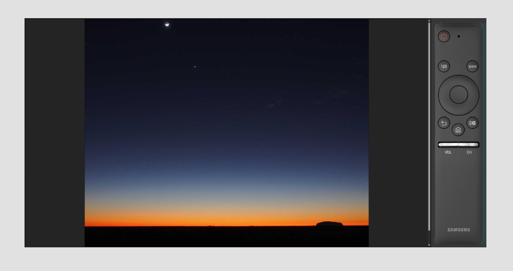
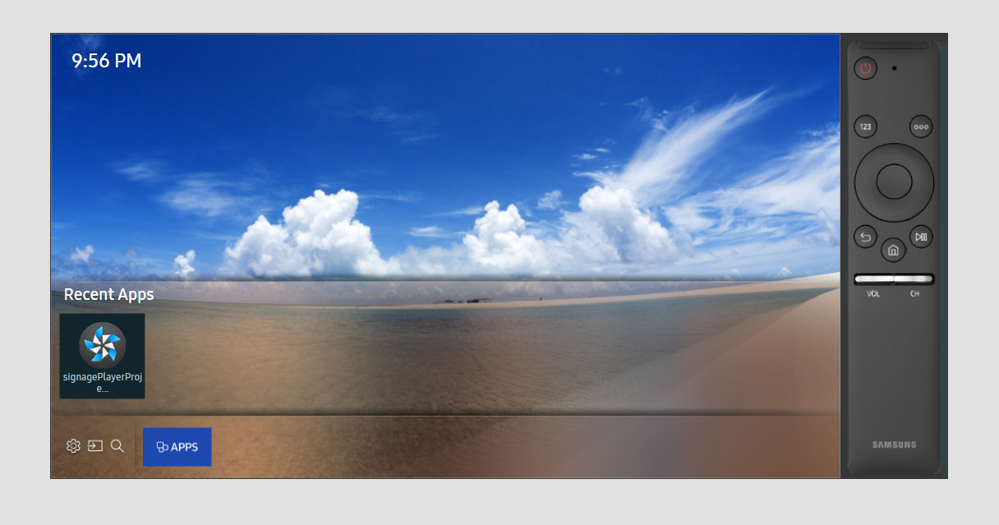

# Smart TV Signage Player

## 1. Overview

Production-oriented Smart TV signage player built with **Vite + TypeScript** using **Hexagonal Architecture (Ports & Adapters)**.

### Key capabilities

- Fetches and validates remote playlists over HTTP.
- Plays image and video media in a continuous loop.
- Handles remote commands over MQTT with idempotency via `correlationId`.
- Publishes `command_ack`, `command_result`, and `heartbeat` events.
- Supports offline-first behavior with LocalStorage playlist cache.
- Caches image assets with the browser Cache API.
- Captures screenshots and returns base64-encoded output.
- Retries MQTT publish operations with exponential backoff.

---

## 2. Architecture

```text
src/
├── core/
│  ├── domain/        # Pure domain models, rules, validators
│  ├── ports/         # Interfaces for adapters (MQTT, storage, renderer, time, etc.)
│  └── application/   # Command mapping, validation, dispatch, gateway logic
├── engine/           # Playback engine (state, sequencing, timers, recovery)
├── infrastructure/   # HTTP, MQTT, renderer, storage, timer adapters
└── main.ts           # Composition root / wiring
```

### Why this architecture

- Core business logic is isolated from framework and platform details.
- Adapters can be replaced (MQTT broker, renderer, storage implementation) without changing domain logic.
- Testability improves because `core` depends on ports, not concrete infrastructure.

---

## 3. Case Coverage Checklist

### Playlist and playback

- Playlist fetch from HTTP endpoint.
- DTO/schema validation before runtime usage.
- Domain mapping and normalization.
- Image playback with explicit duration.
- Video playback until `ended`.
- Playlist loop restart when complete.
- Failed media skip and continue.
- Guard against excessive consecutive playback errors.

### MQTT command pipeline

- Parse incoming command JSON.
- DTO-to-domain mapping.
- Command validation.
- Idempotency check via `correlationId`.
- Publish `command_ack`.
- Execute command.
- Publish `command_result`.
- Persist result with TTL for duplicate replay.

### Offline-first behavior

- Last valid playlist hash + content stored in LocalStorage.
- Fallback to cached playlist when HTTP fails.
- Image cache using Cache API.
- Cached media re-used when network is unavailable.
- Cache limits and TTL enforcement.

**Startup flow:**
1. App attempts to fetch the playlist from `VITE_PLAYLIST_URL` over the network.
2. The response body is hashed (FNV1a) and compared to the hash stored in LocalStorage.
3. Same hash → cache is valid; the stored playlist is used without re-parsing or re-downloading.
4. Different hash or no cache entry → new playlist is validated, stored, and the hash is updated.
5. Network fetch fails → app falls back to the LocalStorage cached playlist if available; logs a warning if neither network nor cache is available.

> **Note:** Video offline caching is not yet implemented. Only images are pre-cached via the Cache API. See [Known Limitations](#10-known-limitations).

### Reliability

- MQTT publish retry with exponential backoff.
- Heartbeat publication for liveness and observability.

---

## 4. MQTT Topics

### Subscribe

```text
players/{deviceId}/commands
```

### Publish

```text
players/{deviceId}/events
```

### Supported commands

- `reload_playlist`
- `restart_player`
- `play`
- `pause`
- `set_volume`
- `screenshot`
- `ota_update`

### Published event types

- `command_ack`
- `command_result`
- `heartbeat`

---

## 5. Message Contracts (JSON examples)

### Command (incoming)

Commands with no payload (`reload_playlist`, `play`, `pause`, `restart_player`) send an empty object:

```json
{
  "command": "reload_playlist",
  "correlationId": "abc12345",
  "timestamp": 1700000000000,
  "payload": {}
}
```

`set_volume` — adjust playback volume (0–100):

```json
{
  "command": "set_volume",
  "correlationId": "vol-001",
  "timestamp": 1700000000000,
  "payload": {
    "volume": 75
  }
}
```

`screenshot` — capture current frame as base64 PNG:

```json
{
  "command": "screenshot",
  "correlationId": "ss-001",
  "timestamp": 1700000000000,
  "payload": {
    "format": "png"
  }
}
```

`ota_update` — trigger remote bundle update (see [Section 20](#20-ota-update-architecture-mock)):

```json
{
  "command": "ota_update",
  "correlationId": "ota-001",
  "timestamp": 1700000000000,
  "payload": {
    "url": "https://cdn.example.com/builds/signage-player-1.2.0.wgt",
    "version": "1.2.0"
  }
}
```

### `command_ack` (outgoing)

```json
{
  "type": "command_ack",
  "timestamp": 1700000000000,
  "payload": {
    "correlationId": "abc12345",
    "command": "reload_playlist",
    "status": "received"
  }
}
```

### `command_ack` statuses

- `received`
- `duplicate`
- `rejected`

### `command_result` success (outgoing)

```json
{
  "type": "command_result",
  "timestamp": 1700000000000,
  "payload": {
    "correlationId": "abc12345",
    "command": "set_volume",
    "status": "success",
    "result": {
      "volume": 50
    }
  }
}
```

### `command_result` error (outgoing)

```json
{
  "type": "command_result",
  "timestamp": 1700000000000,
  "payload": {
    "correlationId": "abc12345",
    "command": "screenshot",
    "status": "error",
    "error": {
      "code": "SCREENSHOT_FAILED",
      "message": "Screenshot failed"
    }
  }
}
```

### `heartbeat` (outgoing)

```json
{
  "type": "heartbeat",
  "timestamp": 1700000000000,
  "payload": {
    "status": "online",
    "deviceId": "tizen-001",
    "uptimeSec": 123,
    "version": "dev"
  }
}
```
---

## 6. Reliability & Design Decisions


MQTT QoS Strategy

The application uses QoS 1 (at least once delivery) for both command consumption and event publishing.

QoS 1 guarantees that a message is delivered at least once, which provides reliability in unstable network conditions. In a signage scenario, losing a command (e.g. restart_player or set_volume) is more critical than processing it twice.

However, QoS 1 may result in duplicate message delivery.
To safely handle this, the application implements an idempotency mechanism based on correlationId.

For every incoming command:

A unique correlationId is required.

The result of the command execution is stored with a TTL (24h).

If a duplicate command with the same correlationId is received:

The command is not executed again.

The previously stored result is re-published.

This design provides:

Reliability (no lost commands)

Safety (no double execution)

Predictable behavior in reconnect/retry scenarios

QoS 0 was rejected because it may silently drop commands.
QoS 2 was considered unnecessary for this use case, as idempotency already guarantees safe duplicate handling without the additional protocol overhead.


Reconnect Strategy

In this project, MQTT disconnection is treated as an expected scenario rather than an exception. Smart TV signage devices typically operate in unstable network environments, so the system must be able to recover automatically without crashing.

The MQTT client uses automatic reconnection. When the connection is restored, the device publishes a heartbeat event to signal that it is online again. Additionally, message publishing implements an exponential backoff retry mechanism to reduce message loss during transient network failures.

This approach ensures:

No manual intervention is required after disconnections

The device can recover from temporary broker unavailability

Improved resilience in command and event delivery

Reconnect behavior is a critical reliability requirement for long-running field devices.


Error Handling Strategy

The error handling strategy in this project is based on a “never crash on bad input” principle. The goal is not to ignore errors but to handle them in a controlled way while keeping the system operational.

The following scenarios are explicitly handled:

Invalid JSON → command rejected

Unsupported command → command_ack: rejected

Payload validation errors → validation error response

Duplicate correlationId → not executed again, previous result returned

Playlist fetch failure → fallback to cached playlist

Media load failure → skip item + consecutive error limit

MQTT publish failure → retry mechanism

This ensures that:

The system does not crash due to malformed input

Invalid data is rejected safely

The player continues operating even under network instability

This reflects a defensive programming mindset expected in production systems.

Logging Strategy

The logging architecture is designed to ensure system observability. Events from the domain and engine layers are categorized using log levels (info, warn, error).

Each log message may include contextual data, enabling traceability. In particular, command flows can be tracked using correlationId.

This design enables:

Traceable command lifecycle

Visibility into retry and failure scenarios

Easier debugging in production environments

Since logging is abstracted through a port, it can easily be extended to support remote logging systems in the future.


Design Assumptions

Several implementation choices were made deliberately for the Tizen Smart TV target environment:

**localStorage over IndexedDB**
Tizen WebKit (as shipped on Samsung TVs) has inconsistent IndexedDB support — some models fail to open databases silently. `localStorage` is synchronous, universally available, and sufficient for the small structured data this app stores (playlist hash + idempotency records). The trade-off is a tight quota (see Known Limitations).

**FNV1a hash for change detection**
The playlist cache compares a stored FNV1a hash of the raw JSON against the newly fetched content. FNV1a is a single-pass, non-cryptographic hash — fast enough to run on every playlist fetch with no perceptible delay. Cryptographic strength is unnecessary here; the goal is cache-validity signaling, not tamper detection.

**24-hour TTL for idempotency records**
Commands are expected to be sent and acknowledged within a single operational day. A 24h window covers this while preventing unbounded storage growth. If a command is replayed after 24h (e.g. due to a very delayed broker retry), it will be executed again — an acceptable trade-off given signage commands are typically idempotent in effect (e.g. reloading a playlist twice produces the same visible result).

---

## 7. Environment Variables

Create a `.env` file in the project root:

```bash
VITE_MQTT_URL=ws://localhost:9001        # WebSocket URL for browser MQTT (use ws:// not mqtt://)
VITE_DEVICE_ID=tizen-001                 # Unique device identifier; used in MQTT topic paths
VITE_APP_VERSION=dev                     # Reported in heartbeat events
VITE_PLAYLIST_URL=http://your-server/playlist.json  # HTTP endpoint for playlist JSON fetch
```

---

## 8. Local Development


### Install dependencies

```bash
npm install
```

### Run development server

```bash
npm run dev
```

### Build for production

```bash
npm run build
```

### Preview production build

```bash
npm run preview
```

### Local MQTT Broker (Docker)

Start a local Mosquitto broker with a single command:

```bash
docker compose up -d
```

This starts the `eclipse-mosquitto:2` container with:

| Port | Protocol | Usage |
|------|----------|-------|
| `1883` | MQTT (TCP) | Native MQTT clients, CLI tools |
| `9001` | WebSocket | Browser clients — **use this for the app** |

Copy `.env.example` to `.env` and the broker URL is already set:

```bash
cp .env.example .env
# VITE_MQTT_URL=ws://localhost:9001  ← ready to use
```

**Topic structure**

| Direction | Topic |
|-----------|-------|
| Subscribe (commands) | `players/{deviceId}/commands` |
| Publish (events) | `players/{deviceId}/events` |

Default `deviceId` is `tizen-001` (override with `VITE_DEVICE_ID` in `.env`).

**Send a test command** (requires `mosquitto_pub`):

```bash
mosquitto_pub -h localhost -p 1883 \
  -t "players/tizen-001/commands" \
  -m '{"command":"reload_playlist","correlationId":"test-001","timestamp":1700000000000}'
```

**Watch events**:

```bash
mosquitto_sub -h localhost -p 1883 -t "players/tizen-001/events"
```

Stop the broker:

```bash
docker compose down
```

---

## 9. Playlist Format

Expected payload:

```json
{
  "playlist": [
    { "type": "image", "url": "/media/a.jpg", "duration": 5 },
    { "type": "video", "url": "/media/b.mp4" }
  ]
}
```

### Notes

- `duration` is required for `image` items (seconds).
- `video` items play until media end.
- Invalid items are rejected during validation.

---

## 10. Known Limitations

- Screenshot capture may fail for cross-origin media without proper CORS headers.
- MQTT reconnection behavior depends on `mqtt.js` reconnect settings.
- Video offline caching is not implemented yet.
- Device-level restart behavior depends on target platform capabilities.
- **Tizen localStorage quota**: On some Samsung TV models the available `localStorage` quota can be below 1 MB. Both `LocalStorageIdempotencyStore` and `LocalStoragePlaylistCache` are affected by this limit. At bootstrap, the application probes `localStorage` availability and automatically falls back to `MemoryIdempotencyStore` if access fails. For the playlist cache, keeping `playlistCacheMaxBytes` low (e.g. 256 KB) is recommended on Tizen targets to avoid quota errors.

---

## 11. Future Improvements

- Publish structured log events over MQTT.
- Add advanced reconnect and circuit-breaker strategy.
- Implement offline video caching strategy.
- Expand automated tests for engine, application gateway, and adapters.
- Add observability metrics (command latency, playback failures, cache hit rates).

---

## 12. Tizen Studio Setup

### Prerequisites

Tizen Studio requires **JDK 8** (not JDK 11 or 17). Using a newer JDK version will cause the IDE to fail at launch or during build.

1. Download and install **JDK 8** from the Oracle archive or use a distribution such as Adoptium Temurin 8.
2. Set `JAVA_HOME` to the JDK 8 directory and ensure it is first on your `PATH`.
3. Verify with:

```bash
java -version
# Expected: openjdk version "1.8.x" or "java version "1.8.x""
```

### Installing Tizen Studio

1. Download **Tizen Studio** (latest stable) from the official Tizen developer site.
2. Run the installer and complete the base IDE installation.
3. After installation, open the **Package Manager** from the Tizen Studio launcher or the `Tools → Package Manager` menu.

### Installing required packages via Package Manager

Open the **Extension SDK** tab in Package Manager and install:

| Package | Required for |
|---|---|
| **TV Extensions** (e.g. `TV Extensions-10.0`) | Samsung TV platform SDK, emulator image, and device profile |
| **Samsung Certificate Extension** | Generating author and distributor certificates for Samsung devices |

After installation, restart Tizen Studio.

---

## 13. Samsung Certificate Manager — Author & Distributor Certificates

Certificates are required to sign the `.wgt` package before it can be installed on a real device or submitted to the Samsung Smart TV app store.

### Creating the author certificate

1. In Tizen Studio, open `Tools → Certificate Manager`.
2. Click the **+** button to create a new certificate profile.
3. Select **Samsung** as the certificate type.
4. Choose **Create a new certificate profile** and give it a name (e.g. `signage-player-cert`).
5. On the **Author Certificate** step, select **Create a new author certificate**.
6. Fill in the required fields (name, country, organization, etc.).
7. Set a password and save the `.p12` file in a secure location.
8. Log in with your Samsung Developer account when prompted (required for distributor signing).

### Creating the distributor certificate

1. After the author certificate step, you will be taken to the **Distributor Certificate** step automatically.
2. Select **Create a new distributor certificate**.
3. Choose privilege level **Public** (sufficient for most signage use cases).
4. The DUID (Device Unique ID) of the target TV must be added here if you are deploying to a specific device.
   - Obtain the DUID from the TV: `Settings → Support → Device Care → Self Diagnosis → TV Device Manager → Device ID`.
5. Complete the wizard. The certificate profile is now active.

> The active certificate profile is used automatically when building a signed package.

---

## 14. Tizen Emulator Manager — TV Emulator Setup

### Creating the emulator

1. Open `Tools → Emulator Manager` in Tizen Studio.
2. Click **Create**.
3. Select platform: **tv-samsung-10.0** (or the version matching your installed TV Extensions).
4. Choose a template (e.g. `HD1080`).
5. Adjust resources (RAM, CPU cores) if needed.
6. Click **Finish**.

### Starting the emulator

1. Select the emulator you just created in the list.
2. Click **Launch**.
3. Wait for the Samsung TV home screen to appear in the emulator window.
4. The emulator exposes a remote debug port (default: `26101`). Tizen Studio connects to it automatically when you run or debug the app.

> The emulator can also be used as a deployment target in the same way as a real device.

---

## 15. Importing the Project into Tizen Studio

### Building the web app

Before importing, build the production bundle:

```bash
npm install
npm run build
```

This produces the `dist/` directory containing `index.html` and all bundled assets.

### Importing the project

1. In Tizen Studio, go to `File → Import → Tizen → Tizen Project`.
2. Select **Import from local file system**, choose the project root directory (`signage-player/`).
3. Click **Finish**. The project appears in the **Project Explorer**.

### Copying dist/ into the project

Tizen Studio serves and packages files from the project root. The `dist/` output must be copied to the project root so `index.html` and all assets are at the top level.

```bash
# From the project root
cp -r dist/* .
```

Or configure the build tool to output directly to the project root by setting `build.outDir` in [vite.config.ts](vite.config.ts):

```ts
build: {
  outDir: '.',   // outputs index.html and assets/ directly to project root
  emptyOutDir: false,
}
```

> `config.xml` references `<content src="index.html"/>`, so `index.html` must be at the root level of the Tizen project, not inside a subdirectory.

---

## 16. Running in the Tizen Web Simulator

The Tizen Web Simulator provides a quick in-browser preview without a full emulator.

1. In **Project Explorer**, right-click the project root.
2. Select `Run As → Tizen Web Simulator Application (Samsung TV)`.
3. The simulator opens in a Chromium-based browser window with a Samsung TV frame.
4. Use the simulator controls to navigate and interact with the app.

> The simulator does not support all Tizen device APIs (e.g. `tizen.systeminfo`). Use the emulator or a real device for full API coverage.

---

## 17. Building a Signed Package (.wgt)

A `.wgt` file is a ZIP archive signed with your Samsung certificates. It is the deployable artifact for both real devices and store submission.

### Steps

1. Ensure the active certificate profile in `Tools → Certificate Manager` is the one created in [Section 13](#13-samsung-certificate-manager--author--distributor-certificates).
2. In **Project Explorer**, right-click the project root.
3. Select `Build → Build Signed Package`.
4. Tizen Studio compiles and signs the project.
5. The output file `signagePlayerProject.wgt` is created in the project root.

### Installing on a real device

```bash
# Connect to the TV via SDB (Samsung Debug Bridge)
sdb connect <TV_IP_ADDRESS>

# Verify connection
sdb devices

# Install the package
tizen install -n signagePlayerProject.wgt -t <device_serial>
```

> The device must have Developer Mode enabled: `Settings → Support → Developer Mode → ON`, then enter the PC IP address.

---

## 18. Tizen Simulator Screenshots

The following screenshots were captured from the **Tizen Web Simulator** running the signage player with a sample playlist.





---

## 19. config.xml Reference

[config.xml](config.xml) is the Tizen application manifest. It controls packaging, permissions, display behavior, and platform targeting.

```xml
<?xml version="1.0" encoding="UTF-8"?>
<widget
  xmlns="http://www.w3.org/ns/widgets"
  xmlns:tizen="http://tizen.org/ns/widgets"
  id="http://yourdomain/signagePlayerProject"
  version="1.0.0"
  viewmodes="maximized">
```

| Attribute | Value | Description |
|---|---|---|
| `id` | `http://yourdomain/signagePlayerProject` | Unique application identifier URI |
| `version` | `1.0.0` | Application version shown in the package manager |
| `viewmodes` | `maximized` | Launches the app in full-screen mode |

---

```xml
<tizen:application id="eE15rwf0yT.signagePlayerProject" package="eE15rwf0yT" required_version="2.3"/>
```

| Attribute | Value | Description |
|---|---|---|
| `id` | `eE15rwf0yT.signagePlayerProject` | Full Tizen application ID (`package.appname`) |
| `package` | `eE15rwf0yT` | 10-character package ID, must match your Samsung developer account |
| `required_version` | `2.3` | Minimum Tizen API version required to run the app |

---

```xml
<content src="index.html"/>
```

Entry point of the application. Tizen loads this file on launch. The Vite build output (`dist/`) must be copied so that `index.html` is at the project root.

---

```xml
<feature name="http://tizen.org/feature/screen.size.normal.1080.1920"/>
```

Declares that the app requires a 1080×1920 (portrait Full HD) screen capability. For landscape Samsung TV deployment the actual rendering is controlled by `screen-orientation` below; this feature tag is part of the standard Tizen TV profile declaration.

---

```xml
<tizen:metadata key="http://tizen.org/metadata/app_ui_type/base_screen_resolution" value="extensive"/>
```

Sets the base screen resolution handling to `extensive`, which tells the platform to scale the app layout to fit the actual display resolution rather than locking to a fixed size.

---

```xml
<tizen:profile name="tv-samsung"/>
```

Targets the Samsung TV platform. Combined with the **TV Extensions-10.0** SDK installed in Package Manager, this ensures the correct APIs and device profile are applied during build and packaging.

---

```xml
<tizen:setting
  screen-orientation="landscape"
  context-menu="enable"
  background-support="disable"
  encryption="disable"
  install-location="auto"
  hwkey-event="enable"/>
```

| Attribute | Value | Description |
|---|---|---|
| `screen-orientation` | `landscape` | Forces landscape layout — standard for TV displays |
| `context-menu` | `enable` | Allows right-click / long-press context menus (useful during development) |
| `background-support` | `disable` | App is suspended when moved to background, conserving resources |
| `encryption` | `disable` | Application resources are not encrypted; enables faster load and easier debugging |
| `install-location` | `auto` | Platform decides install location (internal or external storage) |
| `hwkey-event` | `enable` | Enables hardware remote control key events (needed for TV navigation) |

---

## 20. OTA Update Architecture (Mock)

### Overview

The `ota_update` command provides a hook for remote firmware/bundle updates. The current implementation is a **mock** — it validates the payload and logs the intent without performing any actual download or platform reload. The port abstraction makes it straightforward to replace the mock with a real implementation per target platform.

### Command payload

```json
{
  "command": "ota_update",
  "correlationId": "ota-abc123",
  "timestamp": 1700000000000,
  "payload": {
    "url": "https://cdn.example.com/builds/signage-player-1.2.0.wgt",
    "version": "1.2.0"
  }
}
```

### Architecture

```text
OtaUpdatePort (core/ports/ota-update.port.ts)
  └── MockOtaUpdateAdapter   (infrastructure/ota/ota-update.mock.adapter.ts)
        → logs intent, returns { version, status: "scheduled" }
  └── [future] TizenOtaAdapter
        → downloads bundle, verifies checksum, calls tizen.application API
```

### Successful response

```json
{
  "type": "command_result",
  "timestamp": 1700000000000,
  "payload": {
    "correlationId": "ota-abc123",
    "command": "ota_update",
    "status": "success",
    "result": {
      "version": "1.2.0",
      "status": "scheduled"
    }
  }
}
```

### Validation rules

| Field | Rule |
|---|---|
| `url` | Required, non-empty string |
| `version` | Required, non-empty string |

### Production implementation steps

1. Download the bundle from `url` using `fetch` with progress tracking.
2. Verify the bundle checksum (SHA-256 provided alongside the download URL).
3. Write the bundle to persistent storage via the Tizen File System API.
4. Schedule the reload: `tizen.application.getCurrentApplication().exit()` after confirming the new bundle is in place.
5. Replace `MockOtaUpdateAdapter` with `TizenOtaAdapter` in `main.ts` — no changes to core logic required.
